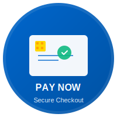

# 💳 ComfortCare Payment Button - Embed Code

## Quick Links
**Payment URL:** https://buy.stripe.com/6oU28t7f16xQdW12QP24001

---

## 📋 Copy & Paste Options

### Option 1: Simple Text Link
```html
<a href="https://buy.stripe.com/6oU28t7f16xQdW12QP24001">
  Pay Now
</a>
```

### Option 2: Button with Icon
```html
<a href="https://buy.stripe.com/6oU28t7f16xQdW12QP24001" class="pay-btn">
  💳 Pay with Stripe
</a>

<style>
  .pay-btn {
    display: inline-block;
    padding: 12px 24px;
    background: #0066cc;
    color: white;
    text-decoration: none;
    border-radius: 6px;
    font-weight: bold;
    transition: background 0.3s;
  }
  .pay-btn:hover {
    background: #0052a3;
  }
</style>
```

### Option 3: Circular Icon Button
```html
<a href="https://buy.stripe.com/6oU28t7f16xQdW12QP24001" class="pay-circle">
  💳
</a>

<style>
  .pay-circle {
    display: inline-flex;
    width: 60px;
    height: 60px;
    align-items: center;
    justify-content: center;
    background: #0066cc;
    color: white;
    text-decoration: none;
    border-radius: 50%;
    font-size: 28px;
  }
</style>
```

### Option 4: SVG Icon Button
```html
<a href="https://buy.stripe.com/6oU28t7f16xQdW12QP24001">
  
</a>
```

### Option 5: Full Width CTA
```html
<a href="https://buy.stripe.com/6oU28t7f16xQdW12QP24001" class="pay-cta">
  💳 Complete Your Payment
</a>

<style>
  .pay-cta {
    display: block;
    padding: 16px;
    background: linear-gradient(135deg, #0066cc, #0052a3);
    color: white;
    text-decoration: none;
    border-radius: 8px;
    text-align: center;
    font-weight: bold;
    font-size: 18px;
    margin: 20px 0;
  }
</style>
```

---

## 🎨 Platform-Specific Instructions

### Facebook / Instagram
1. Copy this text: `Pay your medical equipment rental bill securely with Stripe - https://buy.stripe.com/6oU28t7f16xQdW12QP24001`
2. Add a cover image (use `pay-button-icon.svg`)
3. Post as usual
4. The URL automatically becomes a clickable link

### LinkedIn
```
ComfortCare Medical Equipment Rental - Secure Online Payment

Pay your rental invoice quickly and safely:
https://buy.stripe.com/6oU28t7f16xQdW12QP24001

✓ Credit Card & Bank Debit
✓ Secure Stripe Checkout
✓ Instant Confirmation
```

### Email Signature
```html
<table cellpadding="10" style="text-align: center;">
  <tr>
    <td>
      <a href="https://buy.stripe.com/6oU28t7f16xQdW12QP24001" 
         style="display: inline-block; padding: 12px 24px; background: #0066cc; color: white; text-decoration: none; border-radius: 6px; font-weight: bold;">
        💳 Pay Your Invoice
      </a>
    </td>
  </tr>
</table>
```

### Website (HTML)
```html
<!-- Add this to your website -->
<a href="https://buy.stripe.com/6oU28t7f16xQdW12QP24001" class="payment-button">
  💳 Make a Payment
</a>

<!-- Add the CSS styling from your styles.css -->
```

### QR Code (for printing)
Generate a QR code linking to: `https://buy.stripe.com/6oU28t7f16xQdW12QP24001`
- Use: https://qr-code-generator.com
- Add to invoices, flyers, business cards
- Customers scan → Goes directly to payment

### WhatsApp / SMS
```
Pay your ComfortCare rental invoice here:
https://buy.stripe.com/6oU28t7f16xQdW12QP24001

Secure Stripe checkout - all payment methods accepted!
```

---

## 🎯 Button Styling Recommendations

| Style | Best For | Size |
|-------|----------|------|
| **Text Link** | Email, footer | N/A |
| **Blue Button** | Websites, CTAs | 60-80px tall |
| **Circular Icon** | Social, sidebar | 60-80px diameter |
| **SVG Icon** | Print, digital | Scalable |
| **Full Width** | Mobile, checkout | 100% width |
| **Stripe Badge** | Trustworthy feel | 100-150px |

---

## 📲 Mobile Optimization

All payment buttons above are mobile-responsive. When customers tap on any of these on mobile:
1. Opens Stripe payment page in their browser
2. Shows payment options (card, Apple Pay, Google Pay, etc.)
3. Takes 30 seconds - 2 minutes to complete

---

## 🔗 Direct Link Formats

**Basic URL:**
```
https://buy.stripe.com/6oU28t7f16xQdW12QP24001
```

**With tracking (optional):**
```
https://buy.stripe.com/6oU28t7f16xQdW12QP24001?utm_source=facebook&utm_medium=social
https://buy.stripe.com/6oU28t7f16xQdW12QP24001?utm_source=email&utm_medium=newsletter
```

---

## ✅ Testing

Before posting anywhere, test by:
1. Click the link on desktop
2. Click the link on mobile
3. Complete a test payment
4. Verify invoice arrives in your Stripe account

---

## 📞 Support

Issues with payment link?
- Check that Stripe account is active
- Verify link hasn't expired (Stripe payment links don't expire)
- Test in incognito/private browser mode
- Contact Stripe support if payment page doesn't load

---

**Last updated:** Feb 14, 2026
**Ready to use:** ✅ Yes
